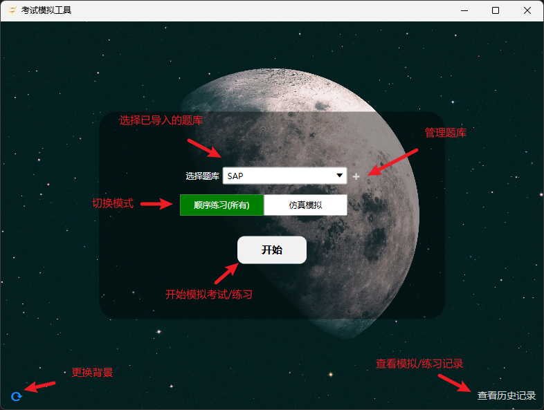

### QTraining - question training tool

 
(自2.2.20版本开始已更名为Panuon.WPF.UI)

#### 0. 来自作者（也就是本人）的碎碎念

这是一个用于模拟刷题的小工具，目前仅适用于选择题，包括单选和多选。  

虽然它的功能很简单，用途也不广，自开发结束到现在算是隔了蛮久才分享出来，但希望它能够帮助到有需要的人，同时我也希望能够收集到更多的使用体验，欢迎用过的朋友提Issue。  

另外，此工具由本人利用工作之余，基于当时自己和同事的需求开发，旨在给大家提供一个~~白嫖淘宝题库~~方便刷题的小工具。项目至此也落灰很久了，可能不会再有新功能推出，不过也欢迎大家提供一些有意思的建议！:smile:  

---

#### 1. 主页功能简介

#### 2. 题库管理功能

#### 3. 主体功能（考试模拟/练习刷题）

#### 4. 添加/编辑解析

此功能隐藏的深，一般人我不告诉他。:joy:  

当点击“显示”按钮后，将鼠标移动至答案上方，会出现“”的提示，点击答案即可添加解析或编辑已有的解析。  

编辑解析内容后点保存，下一次点击显示答案即可将解析内容显示出来。

显示解析。

#### 5. 快捷键

可能你注意到了，这个小工具也是设置了一些快捷键的，以下将所有的快捷键列出来方便大家使用：

| No. | 快捷键 | 功能 |
| --- | --- | --- |
| 1    | Ctrl | 显示/隐藏答案 |
| 2    | ←（左箭头） | 上一题 |
| 3    | →（右箭头） | 下一题 |
| 4    | A/B/C/D/E/F（A~F键） | 选择对应的选项 |

